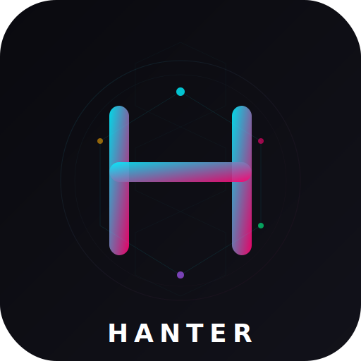

<div align="center">
  
  <h1>HANTER</h1>
  <p><b>Personal Multi-Agent AI Framework</b></p>
  <p>Your digital twin — deploy agents, automate workflows, ship code.</p>

  [](LICENSE)
  [](https://python.org)
  [](https://typescriptlang.org)
  [](https://rust-lang.org)
  [](CONTRIBUTING.md)
  [](https://github.com/Sarkar009765/HANTER/stargazers)

  <br/>

  

  <br/><br/>
</div>

---

## Features

<table>
<tr>
<td width="33%">

### 🧠 Multi-Agent Swarm
5 specialized agents with human-like reasoning, task decomposition, and collaborative execution.

</td>
<td width="33%">

### 💻 2GB RAM Optimized
Lazy loading, compressed embeddings, auto-unloading, emergency RAM mode. Runs on any PC.

</td>
<td width="33%">

### 🎨 Cyberpunk Dashboard
3D neural visualizer, live log stream, voice commands, real-time system metrics.

</td>
</tr>
<tr>
<td>

### 🔒 Local-First
Your data stays on your machine. Optional cloud fallback for LLM inference. No telemetry.

</td>
<td>

### 🛠️ Skill System
Modular plugins loaded on demand. 300s idle auto-unload. Community skill marketplace coming.

</td>
<td>

### 🚀 Real Operations
Actual file operations, git commands, deployment to Vercel/Netlify. Not mocked.

</td>
</tr>
</table>

## Quick Start

```bash
# Clone
git clone https://github.com/Sarkar009765/HANTER.git
cd hanter

# Install dependencies
scripts\setup.bat           # Windows
# OR
chmod +x scripts/*.sh && ./scripts/setup.sh  # Linux/Mac

# Set your LLM API key (optional — mock mode works without it)
set GROQ_API_KEY=gsk_your_key_here          # Windows
# OR
export GROQ_API_KEY="gsk_your_key_here"     # Linux/Mac

# Launch
scripts\dev.bat             # Windows
# OR
./scripts/dev.sh             # Linux/Mac
```

Open your browser to `http://localhost:1420` — HANTER is alive.

## Architecture

```
┌─────────────────────────────────────────────────────────────────────┐
│                         YOUR PC (2GB RAM)                            │
│                                                                      │
│  ┌─────────────────────────┐     ┌─────────────────────────┐        │
│  │   Tauri Desktop UI      │◄───►│   Python Agent Core     │        │
│  │   (Rust + React)        │  WS │   (FastAPI + Uvicorn)   │        │
│  │   ~150MB RAM            │     │   ~300MB RAM            │        │
│  └─────────────────────────┘     └─────────────────────────┘        │
│                                          │                          │
│                                ┌─────────▼─────────┐                │
│                                │  SQLite + ChromaDB │                │
│                                │  ~100MB RAM        │                │
│                                └───────────────────┘                │
│                                                                      │
│  TOTAL BASELINE: ~650MB — leaves ~400MB for active skills & work    │
└─────────────────────────────────────────────────────────────────────┘
```

## Agents

| Agent | Capabilities | RAM |
|-------|-------------|-----|
| **DevAgent** | Code generation, debugging, scaffold, git, deploy (Vercel/Netlify) | 100MB |
| **SocialAgent** | Content creation, scheduling, analytics, engagement | 80MB |
| **WebAgent** | Scraping, URL monitoring, research, archiving | 60MB |
| **FileAgent** | Organization, search, format conversion, sync | 40MB |
| **SysAgent** | Monitoring, automation, cleanup, optimization | 50MB |

Up to **2 agents active simultaneously** — inactive skills auto-unload after 300 seconds.

## Tech Stack

| Layer | Technology | RAM Impact |
|-------|-----------|------------|
| Desktop Shell | Tauri v2 (Rust) | 50MB |
| Frontend | React 19 + TypeScript + Tailwind CSS | 60MB |
| 3D Graphics | React Three Fiber + Three.js | 20MB |
| State | Zustand | 5MB |
| Backend API | FastAPI + Uvicorn | 50MB |
| LLM Router | LiteLLM (Groq / Together / Ollama) | 40MB |
| Vector DB | ChromaDB (SQLite mode) | 60MB |
| Embeddings | Sentence Transformers (all-MiniLM-L6-v2, 22MB) | 30MB |
| Database | SQLAlchemy + aiosqlite | 20MB |
| Security | E2B Sandbox + input validation | 10MB |

## Project Structure

```
hanter/
├── apps/desktop/         # Tauri + React desktop application
│   ├── src/              # React components, hooks, stores, types
│   └── src-tauri/        # Rust backend (system commands, file access)
├── core/                 # Python agent engine
│   ├── agents/           # 5 specialized agents
│   ├── skills/           # Skill system with lazy loader
│   ├── memory/           # Working, short-term, long-term memory
│   ├── engine/           # Orchestrator, planner, router
│   ├── llm/              # LiteLLM client + local Ollama
│   ├── tools/            # Secure shell, browser, file ops
│   ├── api/              # WebSocket + REST endpoints
│   └── config/           # YAML configuration
├── docs/                 # Docusaurus documentation
├── tests/                # Unit + integration + RAM compliance
├── scripts/              # Setup, dev, build scripts
└── .github/workflows/    # CI/CD pipelines
```

## API Overview

### WebSocket (Primary) — `ws://localhost:8000/ws/{session_id}`
```json
// Send command
{"type":"command","id":"uuid","text":"Deploy my React app","timestamp":"..."}

// Receive stream
{"type":"task_update","task_id":"uuid","agent":"dev_agent","status":"running","progress":67,"message":"Building..."}
{"type":"message","role":"assistant","content":"Deployed! https://app.vercel.app"}
```

### REST — `http://localhost:8000/api/v1`

| Method | Endpoint | Description |
|--------|----------|-------------|
| GET | `/health` | Health check |
| GET | `/agents` | List agents |
| GET | `/system/metrics` | RAM/CPU usage |
| GET | `/memory/search?q=...` | Search memory |
| GET | `/tasks` | Task history |
| POST | `/tasks/{id}/cancel` | Cancel task |

## Roadmap

- [x] Core agent framework with 5 agents
- [x] Skill system with lazy loading
- [x] 2GB RAM optimization protocol
- [x] WebSocket real-time communication
- [x] Cyberpunk Tauri desktop UI
- [ ] Community skill marketplace (v1.1)
- [ ] Plugin SDK for third-party skills (v1.2)
- [ ] Mobile companion app (v1.3)
- [ ] Cloud sync with Supabase (v1.4)

## Contributing

See [CONTRIBUTING.md](CONTRIBUTING.md). All contributions welcome — code, docs, ideas, or bug reports.

## License

[MIT](LICENSE) — Free Forever. Use it, modify it, ship it.
